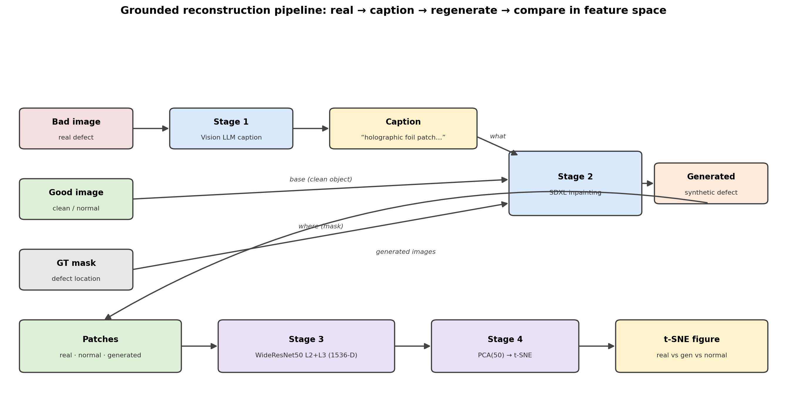

# Grounded Anomaly Reconstruction

Studying the gap between **real and synthetic industrial anomalies** on MVTec AD 2,
in the PatchCore feature space.

**Idea.** For each real defect we (1) caption it with a vision-language model,
(2) inpaint that caption onto a clean image at the real defect's own ground-truth
mask location with a diffusion model, and (3) compare real vs generated vs normal
patches with t-SNE. This tests whether grounding generation in the real defect's
description and location closes the real-vs-synthetic gap.

See `thesis_documents/method.md` for the full method.

## Pipeline

## Repository layout

| Path | Role |
|------|------|
| `src/reconstruct_real_defects.py` | Grounded SDXL-inpaint reconstruction loop |
| `src/analysis/tsne_real_vs_gen.py` | Patch-level real-vs-generated t-SNE |
| `src/analysis/plot_pipeline.py` | Pipeline diagram |
| `thesis_documents/method.md` | Method write-up (+ diagram) |
| `llm_captions*.json` | Per-defect captions paired with their source images |

## Usage

    # 1) Reconstruct real defects for a category
    python src/reconstruct_real_defects.py \
        --src_dir data/preprocessed --category can \
        --captions_json llm_captions_can_full.json \
        --out_dirname recon_llmcaption_full --imgs_per_caption 4 --low_vram

    # 2) Compare real vs generated vs normal in t-SNE
    python src/analysis/tsne_real_vs_gen.py \
        --base data/preprocessed --variant recon_llmcaption_full \
        --memseg-variant '' --categories can --out-dir results/recon_tsne_full

The MVTec AD 2 dataset is not included; point `--src_dir` at your preprocessed
copy with `<category>/{train,test}` splits and `*_GT.png` masks.

## Standalone generation pipeline (latest)

A self-contained version of the loop, driven by the cached captions, with a
quantitative overlap score and per-category defect-crop t-SNE figures.

| Path | Role |
|------|------|
| `src/regenerate.py` | SDXL inpainting: good image + mask + caption -> generated defect |
| `src/run_pipeline.py` | Reads cached captions, generates defects for a category |
| `src/embed_tsne.py` | ResNet50 embeddings + t-SNE + overlap score (`--crop_to_mask`) |
| `figures/tsne_<category>_crop.png` | Defect-crop t-SNE per category (normal / real / generated) |
| `RESULTS.md` | 8-category overlap-score table + how to read the figures |

    # generate defects for a category (reads the cached captions)
    python src/run_pipeline.py --category can \
        --captions_json llm_captions_can_full.json \
        --src_dir dataset/preprocessed --low_vram

    # embed + t-SNE + overlap score, cropped to the defect region
    python src/embed_tsne.py --category can \
        --src_dir dataset/preprocessed --crop_to_mask

See `RESULTS.md` for the 8-category results and figures.
