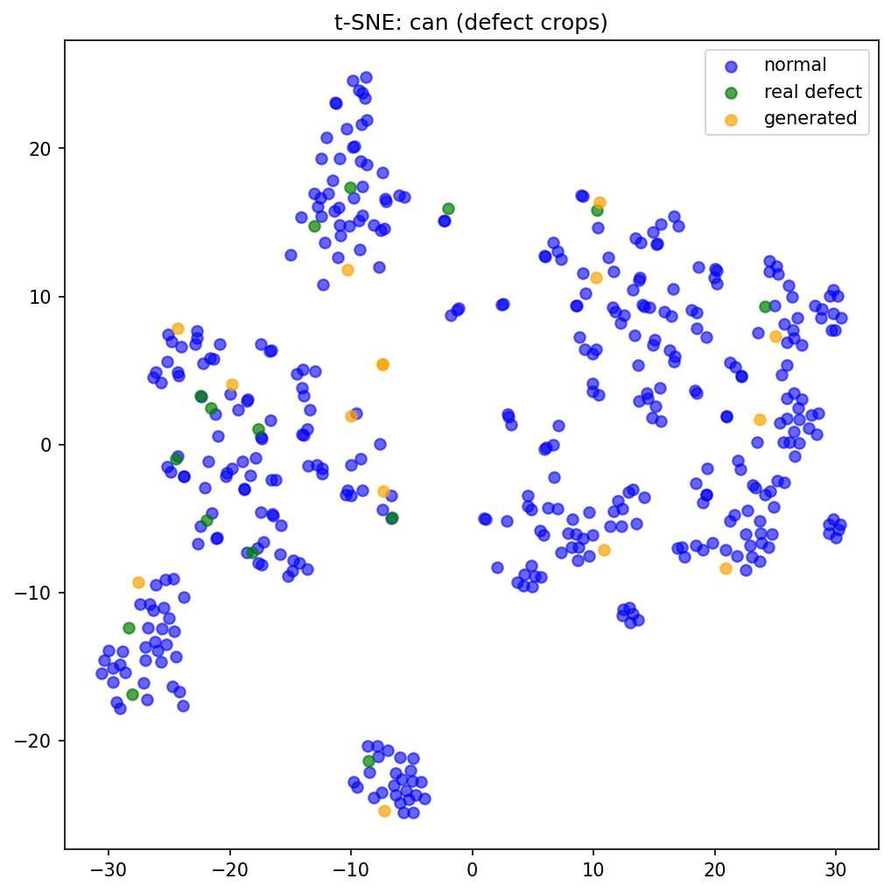

# Method

## 1. Goal

Industrial anomaly detection is held back by how few real defects exist. A natural
remedy is to *generate* synthetic defects, but earlier experiments showed that
synthetic and real anomalies do not overlap in feature space. That comparison was
not fair, however: the generator was driven by generic prompts and random mask
shapes, so it was never actually asked to reproduce a *specific* real defect.

This method removes that confound with a **grounded reconstruction** test. For
each real defect we (i) describe it with a vision–language model and (ii) repaint
that description onto a clean object **at the real defect's own location**. The
synthetic output is therefore a deliberate attempt to reproduce one known real
defect. We then compare real, regenerated, and normal images in feature space
with t-SNE. If grounded regeneration *still* fails to overlap the real defects,
the remaining gap is a property of the **generative model**, not of prompt
wording.

The experiment is run one category at a time.

## 2. Pipeline overview


*(text version of the same diagram:)*

```
  GOOD image (normal) ───────────────────────────────────────┐ base canvas
                                                              │
  BAD image (real defect) ──► [ Stage 1 ] ──► caption ────────┤ "what"
        │                      vision LLM       (text)        │
        │                      caption.py                     ▼
        │                                            [ Stage 2 ]
        │   GT mask ────────────────────────────────► SDXL inpaint ──► REGENERATED
        │   "where"                                   run_pipeline.py      defect
        ▼                                             regenerate.py          │
   ┌──────────────── three image groups ──────────────────┐                 │
   │   real (bad)   ·   regenerated   ·   normal (good)    │ ◄───────────────┘
   └───────────────────────────┬──────────────────────────┘
                               ▼
                      [ Stage 3 ]  ResNet50 embedding (2048-D, cropped to mask)
                               ▼     embed_tsne.py
                          t-SNE → 2-D scatter
                               ▼
              overlap?   real  vs  regenerated  vs  normal
```

A single real **bad** image supplies two things: the *what* (a caption of the
defect) and the *where* (its ground-truth mask). A separate **good** image is the
clean canvas. The diffusion model paints the captioned defect into the masked
region of the good image, producing a **regenerated** defect at the real defect's
location. Finally the real, regenerated, and normal images are embedded into one
feature space and projected with t-SNE, so the figure answers a single question:
**do the regenerated points land on the real ones?**

## 3. Data flow

Each category lives in `dataset/preprocessed/<category>/` with `train/`, `test/`,
and `train.csv` / `test.csv`. Every row is labelled `negative` (normal / good) or
`positive` (defective / bad); each bad image `X.png` has a paired ground-truth
mask `X_GT.png`. From this the three roles are drawn:

- **good (normal)** — `negative` rows: the clean inpainting canvas, and the
  normal group in the t-SNE.
- **bad (real defect)** — `positive` rows with their `_GT` masks: the caption
  source (Stage 1), the defect location (Stage 2), and the real group in the
  t-SNE.

The data then moves through three stages:

| Stage | Input | Process | Output | File |
|---|---|---|---|---|
| **1 — Caption** | real **bad** image | a vision LLM describes the defect in one sentence | caption text, paired with its source path (JSON) | `src/caption.py` |
| **2 — Regenerate** | caption + a random **good** image + the bad image's **GT mask** | SDXL inpainting repaints only the masked region with the captioned defect | regenerated defect image (+ its mask + a `good \| real \| generated` compare strip) | `src/run_pipeline.py`, `src/regenerate.py` |
| **3 — Embed & compare** | real, regenerated, and normal images, each cropped to its defect mask | ResNet50 (classifier removed) → one 2048-D vector per image; all three groups projected together with t-SNE | 2-D scatter coloured by group (+ overlap / separability scores) | `src/embed_tsne.py` |

**Reading the result.** In the t-SNE, regenerated points overlapping the real
points means grounded generation reproduced the defect; regenerated points
sitting apart means it did not. The overlap is only meaningful when the real
defects first separate from the normals — so a *separability* check (real vs
normal) is read alongside the *overlap* (regenerated vs real).

## 4. Stage 1 — Defect captioning (vision LLM)

**Purpose.** Turn a real defect image into a short, defect-specific text
description that can serve directly as the diffusion prompt in Stage 2.

**Procedure.** Each real **bad** image is read and base64-encoded, then sent to a
vision–language model (VLM) together with a fixed instruction. The instruction
states that the image is an industrial inspection photo of a given `<category>`
with a real manufacturing defect, and asks for **one sentence of under 20 words**
describing the defect's **appearance, type, and location**, phrased as a concrete
image-generation prompt, returning only that sentence. The reply is trimmed of
surrounding quotes and any trailing period.

**Design choices.**

- *One short sentence (< 20 words).* The caption becomes the Stage-2 prompt, which
  SDXL encodes with CLIP under a 77-token limit; a short, front-loaded sentence
  keeps the defect description inside that budget rather than being truncated.
- *"appearance, type, and location".* Forces the description to be about the
  defect, not the object, so defect-specific content is carried into generation.
- *"as an image-generation prompt … reply with ONLY that sentence".* Makes the
  output drop-in usable as the Stage-2 prompt with no manual editing.
- *Per-category framing.* Naming the object (`can`, `fabric`, …) lets the model
  describe the deviation from a normal item instead of describing the item itself.

**Output.** Each caption is stored **paired with its source image path**, so it
maps back to the same defect's mask in Stage 2:

```json
{ "captions": { "can": ["…", "…"] },
  "sources":  { "can": ["test/.../000_regular.png", "…"] } }
```

with `captions[cat][i] ↔ sources[cat][i]`. For `can`, a representative caption is
*"A large diamond-pattern holographic silver foil contamination patch covering the
upper-left of the printed grapefruit label"* — describing the **printed-label**
fault, which is the true `can` failure mode (not metal damage).

**Code.** `src/caption.py` — `caption_image(image, category)` returns one caption;
a thin driver applies it to every positive image in a category and writes the JSON
above.

## 5. Stage 2 — Grounded regeneration (diffusion inpainting)

**Purpose.** Reproduce each real defect as a *synthetic* one: paint the captioned
defect onto a clean object at the real defect's own location, so the output is a
deliberate attempt to recreate one known real defect rather than an arbitrary
synthetic anomaly.

**Inputs (per defect).** Three things come together:

- the **caption** from Stage 1 — the *what*;
- a **random good image** from the category's `train.csv` `negative` rows — the
  clean canvas the defect is painted onto;
- the bad image's **GT mask** (`foo.png → foo_GT.png`) — the *where*.

Generating onto a *clean* image (rather than editing the bad image) means the
defect is genuinely synthesised, which is what the experiment tests; using the
real mask grounds its location and shape.

**Procedure.** The good image and mask are resized to a 256×256 canvas; the mask
is loaded with nearest-neighbour resizing and its edges softened with a Gaussian
blur (radius 2) so the synthetic defect blends into the object instead of showing
a hard seam. **Stable Diffusion XL inpainting**
(`diffusers/stable-diffusion-xl-1.0-inpainting-0.1`) repaints **only the masked
region** with the captioned defect, leaving the rest untouched.

The caption is wrapped in a fixed template that steers toward a realistic
inspection photo rather than a stylised image:

> *"photorealistic close-up macro photo of {caption}, industrial inspection
> image, natural lighting, subtle defect"*

and a **per-category negative prompt** suppresses the wrong *family* of defect.
The default list forbids text, logos, cartoons, and oversized/unrealistic shapes.
The `can` category overrides this: because `can` defects are **printed-label
faults** (holographic foil, overprinted text), the negative prompt must **not**
forbid text/letters — instead it forbids physical *metal* damage (dents,
scratches, rust, punctures), which is the wrong defect type. Getting this
override right is what lets the generator target the true defect.

**Settings.**

| Item | Value |
|---|---|
| Model | `diffusers/stable-diffusion-xl-1.0-inpainting-0.1` |
| Canvas | 256×256 |
| Mask edge blur | Gaussian radius 2 |
| Inference steps | 30 |
| Guidance scale | 7.0 |
| Strength | 0.92 |
| Seed | `42 + i` (fixed per defect → reproducible) |

Strength 0.92 nearly fully replaces the masked pixels, so the defect is actually
generated rather than faintly blended, while staying below 1.0 to keep the
repaint coherent with the base; guidance 7.0 follows the prompt without
over-saturating.

**Output.** For each defect `i`, under `dataset/preprocessed/<cat>/<out_dirname>/`
(default `generated/`):

- `NNNN.png` — the regenerated defect image;
- `masks/NNNN_GT.png` — the (resized, blurred) mask, saved so Stage 3 can crop the
  generated image to the same defect region;
- `compare/NNNN.png` — a `good | real | generated` triptych for quick inspection.

Source paths are resolved against both `test/` and `train/`, so the same captions
JSON works whichever split holds the images.

**Code.** `src/run_pipeline.py` (driver: caption–source pairing, mask lookup,
good-image choice, output writing) and `src/regenerate.py` (model loading, prompt
and per-category negative prompt, inpainting, comparison strip).

## 6. Stage 3 — Embedding and t-SNE comparison

**Purpose.** Place the real, regenerated, and normal images in **one feature
space** and compare them, to see whether grounded generation actually reproduced
the real defects.

**Groups.** Three image sets for the category, drawn with the same conventions as
Stages 1–2:

- **real (bad)** — `positive` `*_regular.png` rows of `test.csv`;
- **regenerated** — the top-level PNGs in `generated/` (Stage 2 output);
- **normal (good)** — `negative` rows.

**Defect-region cropping.** A whole-image embedding would be dominated by the
object rather than the small defect, so each image is cropped to its defect's
bounding box (8 px padding) before embedding (`--crop_to_mask`):

- real → its own `_GT` mask;
- regenerated → its saved mask from `generated/masks/`;
- normal → a randomly borrowed real mask, so normal crops match the defect crops
  in scale and the comparison stays fair.

**Embedding.** Each crop is resized to 224×224, ImageNet-normalised, and passed
through a frozen **ResNet50** (ImageNet weights) with its classifier head removed,
giving one **2048-D** vector per image.

**Quantitative scores (on the raw 2048-D features).** Because t-SNE is read
qualitatively, two nearest-neighbour scores back it up:

- **overlap score** — fraction of regenerated crops whose nearest real defect is
  closer than their nearest normal (normals subsampled to the real count, averaged
  over 20 random draws). ≈1 → regenerated look like real defects; ≈0 → like
  normals.
- **separability score** — the mirror for real defects: fraction whose nearest
  *other* real defect is closer than their nearest normal. ≈1 → real defects form
  their own cluster, distinct from normal.

Separability is the **precondition**: the overlap score is only meaningful when
the real defects are separable from normal in the first place.

**t-SNE.** All three groups' vectors are stacked and projected together to 2-D
(`perplexity = min(30, N−1)`, fixed seed 42), so they share one map. The scatter
is coloured normal (blue), real (green), regenerated (orange).

**Reading the figure.** Where regenerated (orange) points land on real (green)
clusters, generation reproduced that defect; orange points scattered among the
blue normals mean it did not. Only neighbourhood/overlap is meaningful — absolute
distances and cluster sizes are not.

**Output.** `tsne_<category>_crop.png` (default in the category dir; `--out` points
it to `results/`), plus the two scores printed to the console.

**Code.** `src/embed_tsne.py`.

---

## 7. Results

The pipeline was run end-to-end on all eight MVTec AD 2 categories — 15 distinct
real defects each, regenerated and compared against the category's normal images,
every crop taken at the defect region (`--crop_to_mask`). The two scores, ordered
by overlap:

| Category | Real | Normal | Overlap | Separability |
|---|---|---|---|---|
| `fabric` | 15 | 387 | 0.71 | 0.55 |
| `wallplugs` | 15 | 293 | 0.69 | 0.69 |
| `rice` | 15 | 313 | 0.54 | 0.30 |
| `can` | 15 | 412 | 0.51 | 0.53 |
| `vial` | 15 | 291 | 0.51 | 0.36 |
| `sheet_metal` | 15 | 137 | 0.41 | 0.33 |
| `walnuts` | 15 | 432 | 0.40 | 0.56 |
| `fruit_jelly` | 15 | 263 | 0.32 | 0.38 |

(overlap ∈ [0,1]: 1 = generated look like real defects; separability ∈ [0,1]:
1 = real defects distinct from normal. Figures: `results/tsne_<category>_crop.png`.)

### Worked example — `can`

The vision-LLM captions identify the true `can` failure mode — **printed-label
faults** (holographic foil patches, overprinted advertising text, mis-registered
labels), not metal damage — so generation is conditioned on the right defect and
any gap is not a captioning error. Scores: overlap **0.51**, separability **0.53**.



Reading the figure: the real defects (green) are scattered throughout the normal
cloud (blue) rather than forming their own cluster — at image-crop level a `can`
crop is dominated by the printed label, so a defect crop embeds much like a normal
crop. Because real defects are not separable from normal, the overlap (orange near
green) is only weakly interpretable: "near a real defect" also tends to mean "near
a normal." That overlap ≈ separability (0.51 ≈ 0.53) is internally consistent but
not strong evidence either way.

### Overall reading

- **Separability is moderate-to-weak across all eight categories (0.30–0.69).** In
  every category the real-defect points stay embedded in the normal cloud rather
  than forming a clean island — even the highest, `wallplugs` (0.69), shows the
  green points mixed throughout. At image-crop level the defect is small relative
  to the object, so real defects do not separate cleanly from normal anywhere.
- **The overlap scores are therefore a *relative* screen, not a precise ranking.**
  At small N (15 real vs 15 generated) and with weak separability, where overlap
  exceeds separability (`rice` 0.54 vs 0.30, `vial` 0.51 vs 0.36) the high overlap
  partly reflects that real *and* generated both sit in the normal cloud, not that
  the defect was reproduced.
- **Relative spectrum (with that caveat).** `fabric`/`wallplugs` — generated land
  nearest real; `rice`/`can`/`vial` — mixed; `sheet_metal`/`walnuts`/`fruit_jelly`
  — generated drift to the periphery, away from real (clearest in `fruit_jelly`,
  overlap 0.32).
- **Conclusion.** Grounding generation in the real defect's caption and location
  narrows but does not cleanly close the real–synthetic gap, and the image-level
  embedding under-separates all groups, limiting how strongly these figures can be
  read. A **patch-level** embedding — which isolates the defect's own feature cells
  — separates real defects more cleanly and is the more sensitive test of overlap;
  the image-level scores here are best read as a coarse, relative screen.
